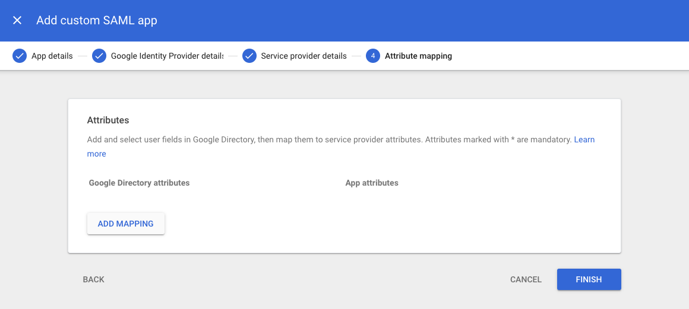
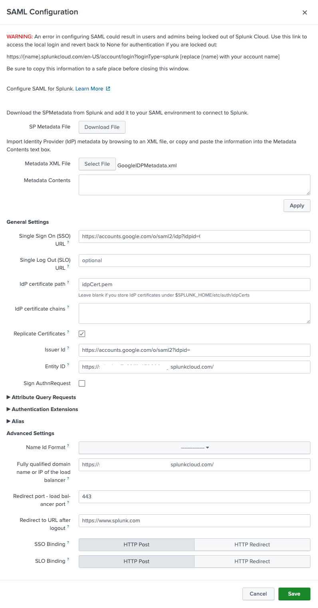

# Configuring Google Workspace as a SAML IdP with Splunk Cloud

This document details setup instructions for using Google Workspace as a SAML Identity Provider with a Splunk Cloud instance.

## Google

### Create a custom attribute

Create a custom attribute to manage the Splunk user role in the Google Workspace directory.

Click "Directory" > "Users" > "More Options" > "Manage custom attributes."

In the next screen, click "Add Custom Attribute."

Configure the new custom attribute with the following parameters.

- Category
  - splunk
- Description
  - splunk
- Custom fields
  - Name
      - role
  - Info type
      - Text
  - Visibility
      - Visible to user and admin
  - No. of values
      - Multi-value

See the following screenshot for an example.

### Create a custom SAML application

Next, you will need to create a custom Splunk SAML application.

Click "Apps" > "Web and mobile apps" > "Add app" > "Add custom SAML app."

In the "App details" screen, enter an application name and description. You may also upload an icon for the application. Click "Continue" to proceed.

The next screen allows you to download the IdP metadata file. Click "Download Metadata" and save this to a download folder. You will need this file when setting up the Splunk portion of the SAML configuration. You may want to also take a screenshot for reference.

On the "Service provider details" screen, information about the Splunk Cloud instance must be configured. Use the following values, substituting the actual URL of your Splunk Cloud instance.

- ACS URL
  - https://**YOUR-INSTANCE**.splunkcloud.com/saml/acs
- Entity ID
  - https://**YOUR-INSTANCE**.splunkcloud.com/
- Start URL
  - https://**YOUR-INSTANCE**.splunkcloud.com/

See the following screenshot for an example. Click "Continue" once complete.

The last screen allows attribute mappings to be configured. This will control what user attributes are sent to Splunk during the SAML authentication flow. Click "Add mapping" to start adding attributes.

Add the following attribute mappings. Be mindful of case.

|Google Directory Attributes|App Attributes|
|---|---|
|First name|Name|
|Primary email|Email|
|role|role|

See the following screenshot for an example set of mappings. Click "Finish."

### Enable application

After configuring Splunk as a SAML application, a summary screen is displayed. Under "User Access," notice that the application is marked as "OFF for everyone."

Click on the words "OFF for everyone". The next screen allows enabling the SAML application across the organization. Click the "ON for everyone" radio button and "Save" to proceed.

### Grant users access to application

The final Google configuration step is to configure a user role. Click on "Directory" > "Users". Next, click a username. You will be taken to a user summary page as seen in the screenshot below.

Click "User details" under "User information." This will take you to a new page where you can set the Splunk role. Scroll down until you see the role attribute. In the screenshot example below, the role has been set to "user". This role must map to a local role on the Splunk Cloud instance.

## Splunk

Once the Google Workspace portion has been configured, you are ready to configure the Splunk SAML settings. Log in to Splunk as an administrator. Click "Settings" > "Users and Authentication" > "Authentication Methods." Choose the "SAML" radio button next to "External". Click the "SAML Settings" link to proceed to the Identity Provider setup screen.

On the SAML Configuration screen, click "Select File" next to "Metadata XML File". Find the "GoogleIDPMetadata.xml" file previously downloaded when setting up the Splunk SAML application in the Google configuration steps. This should complete most of the required fields.

Other fields that you should set are as follows:

- Entity ID
  - https://**YOUR-INSTANCE**.splunkcloud.com/
- Fully qualified domain name or IP of the load balancer
  - https://**YOUR-INSTANCE**.splunkcloud.com/
- Redirect port - load balancer port
  - 443
- Redirect to URL after logout
  - https://www.splunk.com/

See the following screenshot for an example.

Click "Save"to exit. You are now ready to test.

## Testing

Open an Incognito browser and browse to your Splunk Cloud instance. You should be redirected to Google for authentication. Once authenticated, you are redirected back to the Splunk Cloud instance as part of the normal SAML assertion flow. That's it!

## Tips

An error in configuring SAML could result in users and admins being locked out of Splunk Cloud. Use this link to access the local login and revert back to None for external authentication if you are locked out during the configuration process:

https://{name}.splunkcloud.com/en-US/account/login?loginType=splunk [replace {name} with your account name]

## Resources

The following links provide helpful configuration resources.

- [Set up your own custom SAML application](https://support.google.com/a/answer/6087519?hl=en&ref_topic=7559288)
- [SAML app error messages](https://support.google.com/a/answer/6301076?hl=e)
